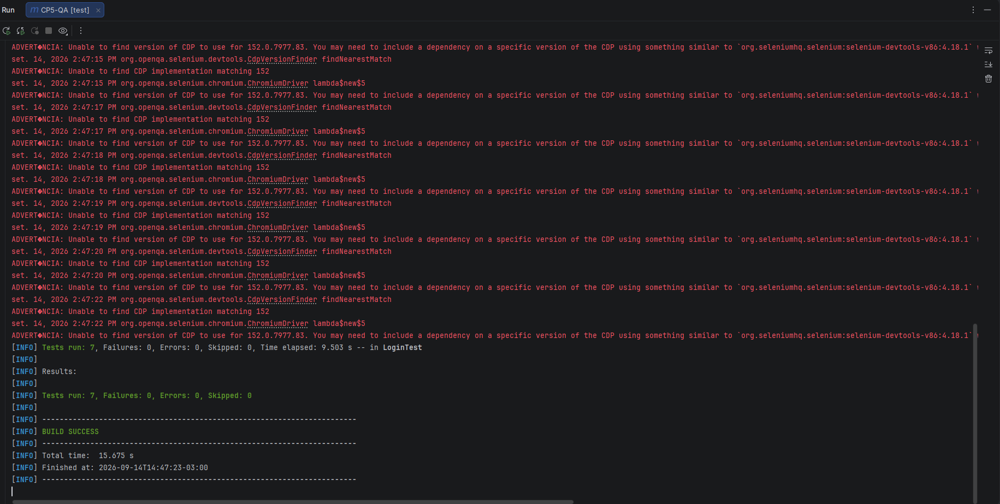
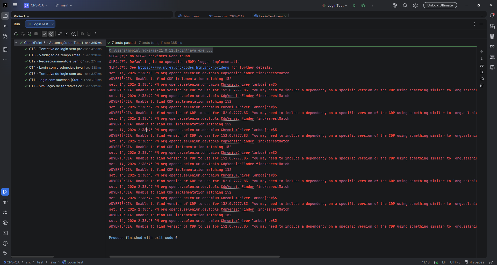

# CheckPoint 5 - Automação de Testes Funcionais (Login)

Este repositório contém a automação dos cenários de testes funcionais da **Tela de Login** do sistema **SauceDemo**, desenvolvidos como parte do **CheckPoint 5** da disciplina de Compliance QA e Engenharia de Software.

A suíte de testes foi construída com base na matriz do **CheckPoint 4**, alinhando os testes automatizados aos pilares da **ISO 27001** (Confidencialidade, Integridade e Disponibilidade) e ao método **4S8P**.

| Nome | RM |
|---|---|
| Gustavo Pinheiro de Oliveira | RM566358 |

---

## 🚀 Tecnologias Utilizadas

- **Linguagem**: Java 21
- **Framework de Testes**: JUnit 5 (Jupiter)
- **Automação Web**: Selenium WebDriver 4.18.21
- **Gerenciador de Dependências**: Apache Maven
- **Target Application**: [SauceDemo](https://www.saucedemo.com/)

---

## 🛠️ Estrutura do Projeto

```text
checkpoint5-login-automation/
├── pom.xml
├── README.md
└── src/
    └── test/
        └── java/
            └── LoginTest.java
```

---

## 📋 Cenários Automatizados (`LoginTest.java`)

| Caso de Teste | Status HTTP | Descrição / Objetivo | Pilar ISO 27001 |
| :--- | :---: | :--- | :--- |
| **CT1** | `200 OK` | Login com credenciais válidas (`standard_user` + `secret_sauce`) | Confidencialidade |
| **CT2** | `302 Found` | Validação de redirecionamento para `/inventory.html` pós-autenticação | Integridade |
| **CT3** | `400 Bad Request` | Tentativa de login omitindo o usuário (validação de campo obrigatório) | Integridade |
| **CT4** | `401 Unauthorized` | Login com credenciais inválidas (exibição de mensagem genérica antienumeração) | Confidencialidade |
| **CT5** | `403 Forbidden` | Login com usuário bloqueado (`locked_out_user`) | Confidencialidade / Acesso |
| **CT6** | `408 Timeout` | Validação do tempo de resposta de autenticação (< 10 segundos) | Disponibilidade |
| **CT7** | `429 Too Many Req.` | Múltiplas tentativas incorretas consecutivas (proteção contra brute force) | Disponibilidade / Segurança |

---

## 🔧 Como Executar os Testes Localmente

### Pré-requisitos
1. **JDK 21** instalado e configurado nas variáveis de ambiente (`JAVA_HOME`).
2. **Apache Maven 3.x** instalado.
3. Navegador **Google Chrome** instalado (o Selenium 4 gerencia o ChromeDriver automaticamente via Selenium Manager).

### Passos de Execução

1. **Clonar o Repositório**:
   ```bash
   git clone https://github.com/fiapeiro/checkpoint5-login-automation
   cd checkpoint5-login-automation
   ```

2. **Executar via Linha de Comando (Terminal / Prompt)**:
   ```bash
   mvn clean test
   ```

3. **Executar via IDE (IntelliJ IDEA / Eclipse / VS Code)**:
   - Abra a pasta do projeto na sua IDE.
   - Aguarde o carregamento das dependências do `pom.xml`.
   - Navegue até `src/test/java/LoginTest.java`.
   - Clique com o botão direito sobre a classe `LoginTest` e selecione **Run 'Login'** (ou `Run All Tests`).

---

## 📸 Evidências de Execução (Prints)

### Evidência 1: Resultado do `mvn test`



### Evidência 2: Painel de testes executados


